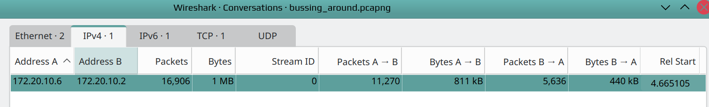
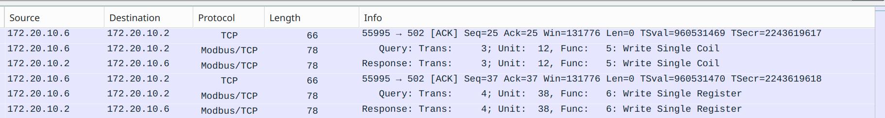
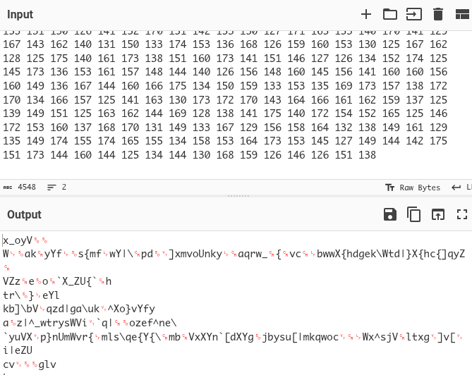
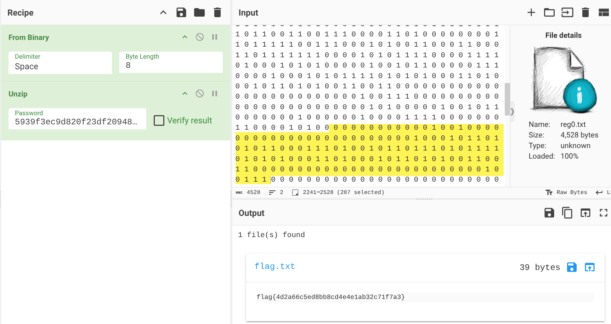

# Bussing Around

Bussing Around is a Forensics challenge from the Huntress CTF 2025.

<em>
One of the engineers noticed that an HMI was going haywire.

He took a packet capture of some of the traffic but he can't make any sense of it... it just looks like gibberish!

For some reason, some of the traffic seems to be coming from someone's computer. Can you help us figure out what's going on?
</em>

For this challenge we are provided with a packet capture. First, I checked the statistics. This packet capture is very clean - only showing one pair of hosts without the usual Microsoft Update mess that needs to be filtered out on many challenges. Very nice.




I next took a look at the capture itself and identified modbus traffic between a client and a server. Only two modbus functions were represented - 6: Write Single Coil, and 6: Write Single Register. I had a quick look through the packets and it looked as though only function 6 was capable of writing arbitrary data. Reading up on the protocol confirmed this:

[https://www.modbustools.com/modbus.html](https://www.modbustools.com/modbus.html)



Looking at the writes, the values were mostly too high to be ascii except for what looked like some padding zeroes. I thought there was a chance the flag might have been encoded as octal. I next used `tshark` to extract all of the register values and then tried various ways of decoding them. Nothing was working and it felt like I had too much data. I went back to the capture to find some logic that would determine what to extract. Looking again I realised there were three registers being written to - 0, 4, and 10. Register 10 had my octal looking values so I ran the extraction again with only the register 10 values and ... still nothing sensible.



I decided to isolate the other registers and see if they made more sense. Register 0 once I extracted it held what looked like binary.

```
tshark -r bussing_around.pcapng -Y "modbus.func_code == 6 && modbus.regnum16 == 0 && ip.src == 172.20.10.2" -T fields -e modbus.regval_uint16


1 0 1 1 0 0 0 0 0 1 1 1 0 0 0 0 1 0 0 0 1 0 1 0 1 1 1 1 0 1 0 1 0 1 0 0 0 1 1 0 1 <snip>
```

I loaded it into CyberChef and saw the headers for a standard PK zip file as well as some plaintext around it that showed a zip file password. 


Since the data was already loaded into CyberChef, I tried the unzip tool. It allowed me to supply a password and display the flag.



[CyberChef Recipe](https://gchq.github.io/CyberChef/#recipe=From_Binary('Space',8)Unzip('5939f3ec9d820f23df20948af09a5682',false)&input=MCAxIDAgMSAwIDAgMCAwIDAgMSAwIDAgMSAwIDEgMSAwIDAgMCAwIDAgMCAxIDEgMCAwIDAgMCAwIDEgMCAwIDAgMCAwIDAgMSAwIDEgMCAwIDAgMCAwIDAgMCAwIDAgMCAwIDAgMCAxIDAgMCAxIDAgMCAwIDAgMCAwIDAgMCAwIDAgMCAwIDAgMCAwIDAgMCAwIDAgMCAwIDAgMCAwIDEgMCAwIDAgMSAwIDEgMSAwIDEgMCAxIDAgMSAxIDAgMCAwIDEgMSAxIDAgMSAwIDAgMSAwIDEgMSAwIDEgMSAxIDAgMSAwIDEgMSAxIDEgMCAxIDAgMSAwIDEgMCAwIDAgMSAxIDAgMSAwIDAgMCAxIDAgMSAxIDAgMSAwIDEgMCAwIDEgMSAwIDAgMSAxIDAgMCAwIDAgMCAwIDAgMCAwIDAgMCAwIDAgMCAwIDAgMCAwIDAgMCAwIDAgMCAwIDAgMCAxIDAgMCAxIDEgMSAwIDAgMCAwIDAgMCAwIDAgMCAwIDAgMCAwIDAgMCAwIDAgMCAwIDAgMCAwIDAgMCAwIDAgMCAwIDEgMCAwIDAgMCAwIDAgMCAwIDAgMCAwIDAgMCAwIDEgMSAxIDAgMCAwIDAgMCAwIDAgMCAwIDAgMCAxIDEgMCAwIDEgMSAwIDAgMSAxIDAgMSAxIDAgMCAwIDEgMSAwIDAgMCAwIDEgMCAxIDEgMCAwIDEgMSAxIDAgMCAxIDAgMSAxIDEgMCAwIDEgMSAxIDAgMSAwIDAgMCAxIDEgMSAxIDAgMCAwIDAgMSAxIDEgMCAxIDAgMCAwIDEgMCAxIDAgMSAwIDEgMCAxIDAgMSAwIDEgMCAwIDAgMCAwIDAgMSAwIDAgMSAwIDAgMCAwIDAgMCAwIDAgMCAwIDAgMCAwIDAgMSAxIDEgMCAxIDAgMCAxIDAgMSAxIDAgMSAwIDEgMCAwIDAgMSAxIDAgMSAwIDEgMSAwIDAgMSAxIDAgMSAwIDAgMCAxIDEgMSAwIDAgMSAxIDAgMSAwIDEgMCAxIDAgMCAwIDEgMSAwIDEgMCAxIDEgMCAwIDEgMSAwIDEgMCAwIDAgMCAxIDEgMSAwIDEgMCAxIDAgMSAxIDEgMSAwIDAgMCAwIDAgMCAwIDEgMCAxIDEgMCAwIDAgMCAwIDAgMCAwIDAgMCAwIDAgMCAwIDAgMSAwIDAgMCAwIDAgMSAwIDAgMSAxIDEgMCAxIDAgMCAwIDAgMCAwIDAgMCAwIDEgMSAwIDAgMCAwIDAgMCAwIDAgMCAwIDAgMCAwIDAgMCAwIDAgMCAwIDAgMCAxIDAgMCAxIDEgMSAwIDEgMCAwIDAgMCAwIDAgMCAwIDAgMSAxIDAgMCAwIDAgMCAwIDAgMCAwIDAgMCAwIDAgMCAwIDAgMSAxIDAgMCAwIDEgMSAxIDAgMSAxIDEgMSAxIDAgMSAwIDEgMSAxIDEgMSAxIDEgMSAwIDAgMSAxIDAgMCAwIDEgMCAxIDAgMCAwIDEgMCAwIDAgMCAxIDEgMCAxIDAgMCAwIDAgMSAwIDAgMSAwIDAgMCAxIDEgMSAwIDAgMCAwIDAgMSAwIDEgMCAxIDAgMSAxIDAgMCAwIDAgMSAxIDEgMCAxIDAgMCAwIDAgMCAxIDAgMSAwIDEgMSAwIDEgMCAxIDAgMCAwIDAgMCAxIDAgMCAxIDEgMSAwIDAgMCAxIDAgMSAxIDAgMCAwIDEgMCAxIDEgMSAwIDEgMSAwIDEgMSAwIDEgMSAwIDEgMSAxIDEgMSAwIDEgMCAwIDAgMCAxIDAgMSAwIDEgMCAxIDEgMCAxIDAgMSAwIDEgMCAxIDEgMCAwIDAgMSAxIDAgMSAxIDEgMSAwIDAgMSAwIDEgMCAxIDAgMCAxIDEgMCAxIDEgMSAxIDEgMSAwIDAgMCAxIDAgMCAxIDAgMCAwIDAgMCAxIDAgMCAxIDAgMSAwIDAgMCAxIDEgMSAxIDEgMSAwIDAgMCAxIDEgMCAwIDEgMSAxIDEgMCAxIDAgMCAwIDAgMCAxIDEgMCAxIDAgMSAxIDAgMCAxIDEgMCAxIDAgMSAwIDEgMCAwIDAgMSAxIDAgMSAxIDAgMSAwIDAgMCAwIDEgMCAwIDEgMSAwIDAgMCAwIDAgMCAxIDAgMSAxIDEgMSAxIDEgMCAxIDAgMCAxIDAgMSAwIDAgMCAxIDAgMSAwIDAgMSAxIDEgMCAxIDEgMSAxIDAgMSAxIDEgMSAwIDEgMSAwIDAgMSAxIDAgMCAxIDEgMSAwIDAgMCAwIDEgMSAwIDEgMCAwIDAgMCAwIDAgMCAwIDEgMSAwIDEgMSAxIDEgMSAwIDAgMSAxIDEgMCAwIDAgMSAwIDEgMCAwIDEgMSAwIDAgMCAxIDEgMCAwIDAgMSAxIDAgMSAxIDEgMSAxIDEgMSAwIDAgMCAwIDEgMCAxIDAgMSAxIDEgMSAwIDAgMCAwIDEgMSAxIDEgMCAxIDAgMCAwIDEgMCAxIDAgMSAwIDAgMCAwIDAgMSAwIDAgMSAwIDEgMSAwIDAgMCAwIDAgMSAxIDEgMCAwIDAgMCAxIDAgMCAwIDEgMCAxIDAgMSAxIDEgMSAwIDEgMCAxIDAgMSAwIDAgMCAxIDEgMCAxIDAgMCAwIDEgMCAxIDEgMCAxIDAgMSAwIDAgMSAxIDAgMCAxIDEgMCAwIDAgMCAwIDAgMCAwIDAgMCAwIDAgMCAwIDAgMCAwIDAgMCAwIDAgMCAwIDAgMCAwIDEgMCAwIDEgMSAxIDAgMCAwIDAgMCAwIDAgMCAwIDAgMCAwIDAgMCAwIDAgMCAwIDAgMCAwIDAgMCAwIDAgMSAwIDEgMCAwIDAgMCAwIDEgMCAwIDEgMCAxIDEgMCAwIDAgMCAwIDAgMCAxIDAgMCAwIDAgMCAwIDEgMCAwIDAgMCAxIDEgMSAxIDAgMCAwIDAgMCAwIDAgMSAxIDAgMCAwIDAgMSAwIDEgMCAwIDAgMCAwIDAgMCAwIDAgMCAwIDAgMCAxIDAgMCAxIDAgMCAwIDAgMCAwIDAgMCAwIDAgMCAwIDAgMCAwIDAgMCAwIDAgMCAwIDAgMCAwIDEgMCAwIDAgMSAwIDEgMSAwIDEgMCAxIDAgMSAxIDAgMCAwIDEgMSAxIDAgMSAwIDAgMSAwIDEgMSAwIDEgMSAxIDAgMSAwIDEgMSAxIDEgMCAxIDAgMSAwIDEgMCAwIDAgMSAxIDAgMSAwIDAgMCAxIDAgMSAxIDAgMSAwIDEgMCAwIDEgMSAwIDAgMSAxIDAgMCAwIDAgMCAwIDAgMCAwIDAgMCAwIDAgMCAwIDAgMCAwIDAgMCAwIDAgMCAwIDAgMCAxIDAgMCAxIDEgMSAwIDAgMCAwIDAgMCAwIDAgMCAwIDAgMCAwIDAgMCAwIDAgMCAwIDAgMCAwIDAgMCAwIDAgMCAwIDEgMCAwIDAgMCAwIDAgMCAwIDAgMCAwIDAgMCAwIDEgMSAwIDAgMCAwIDAgMCAwIDAgMCAwIDAgMCAwIDAgMCAwIDAgMCAwIDAgMCAwIDAgMCAwIDAgMCAwIDAgMCAwIDAgMCAwIDAgMCAwIDAgMCAwIDAgMCAwIDAgMCAwIDAgMCAwIDAgMSAwIDAgMCAwIDAgMCAwIDAgMCAwIDAgMCAwIDAgMCAwIDAgMCAwIDAgMCAwIDAgMCAxIDAgMSAxIDAgMSAwIDAgMSAwIDAgMCAwIDAgMCAxIDAgMCAwIDAgMCAwIDAgMCAwIDAgMCAwIDAgMCAwIDAgMCAwIDAgMCAwIDAgMCAwIDAgMCAwIDAgMCAwIDAgMCAwIDEgMSAwIDAgMSAxIDAgMCAxIDEgMCAxIDEgMCAwIDAgMSAxIDAgMCAwIDAgMSAwIDEgMSAwIDAgMSAxIDEgMCAwIDEgMCAxIDEgMSAwIDAgMSAxIDEgMCAxIDAgMCAwIDEgMSAxIDEgMCAwIDAgMCAxIDEgMSAwIDEgMCAwIDAgMSAwIDEgMCAxIDAgMSAwIDEgMCAxIDAgMSAwIDAgMCAwIDAgMCAwIDEgMCAxIDAgMCAwIDAgMCAwIDAgMCAwIDAgMCAwIDAgMCAxIDEgMSAwIDEgMCAwIDEgMCAxIDEgMCAxIDAgMSAwIDAgMCAxIDEgMCAxIDAgMSAxIDAgMCAxIDEgMCAxIDAgMCAwIDAgMSAxIDEgMCAxIDAgMSAwIDEgMSAxIDEgMCAwIDAgMCAwIDAgMCAxIDAgMSAxIDAgMCAwIDAgMCAwIDAgMCAwIDAgMCAwIDAgMCAwIDEgMCAwIDAgMCAwIDEgMCAwIDEgMSAxIDAgMSAwIDAgMCAwIDAgMCAwIDAgMCAxIDEgMCAwIDAgMCAwIDAgMCAwIDAgMCAwIDAgMCAwIDAgMCAwIDAgMCAwIDAgMSAwIDAgMSAxIDEgMCAxIDAgMCAwIDAgMCAwIDAgMCAwIDEgMSAwIDAgMCAwIDAgMCAwIDAgMCAwIDAgMCAwIDAgMCAwIDAgMSAwIDEgMCAwIDAgMCAwIDEgMCAwIDEgMCAxIDEgMCAwIDAgMCAwIDEgMCAxIDAgMCAwIDAgMCAxIDEgMCAwIDAgMCAwIDAgMCAwIDAgMCAwIDAgMCAwIDAgMCAwIDAgMCAwIDAgMCAwIDAgMCAwIDAgMCAwIDAgMCAwIDAgMCAwIDAgMCAwIDAgMCAxIDAgMCAwIDAgMCAwIDAgMCAwIDAgMCAwIDAgMCAwIDEgMCAwIDAgMCAwIDAgMCAwIDAgMSAwIDAgMSAxIDEgMCAwIDAgMCAwIDAgMCAwIDAgMCAwIDAgMCAwIDAgMCAwIDAgMCAwIDAgMCAwIDAgMCAxIDAgMCAwIDAgMSAwIDEgMCAwIDAgMCAwIDAgMCAwIDAgMCAwIDAgMCAwIDAgMCAwIDAgMCAwIDAgMCAwIDAgMCAwIDEgMSAwIDAgMSAwIDAgMCAwIDAgMCAwIDAgMCAwIDEgMCAxIDAgMSAwIDAgMCAxIDEgMCAxIDAgMCAwIDAgMSAxIDAgMCAxIDAgMSAwIDAgMSAwIDAgMCAwIDAgMCAxIDEgMSAwIDAgMCAwIDAgMSAxIDAgMCAwIDAgMSAwIDEgMSAxIDAgMCAxIDEgMCAxIDEgMSAwIDAgMSAxIDAgMSAxIDEgMCAxIDEgMSAwIDEgMSAwIDEgMSAxIDEgMCAxIDEgMSAwIDAgMSAwIDAgMSAxIDAgMCAxIDAgMCAwIDAgMSAwIDAgMCAwIDAgMCAxIDEgMCAxIDAgMCAxIDAgMSAxIDEgMCAwIDEgMSAwIDAgMSAwIDAgMCAwIDAgMCAwIDEgMSAwIDEgMCAxIDAgMCAxIDEgMSAwIDAgMSAwIDAgMSAxIDAgMCAxIDEgMCAwIDEgMSAxIDAgMCAxIDAgMSAxIDAgMCAxIDEgMCAwIDAgMSAxIDAgMCAxIDEgMCAxIDEgMCAwIDEgMCAxIDAgMSAxIDAgMCAwIDEgMSAwIDAgMSAxIDEgMCAwIDEgMCAxIDEgMCAwIDEgMCAwIDAgMCAxIDEgMSAwIDAgMCAwIDAgMSAxIDAgMCAxIDAgMCAwIDEgMSAwIDAgMCAwIDAgMSAxIDAgMCAxIDEgMCAwIDAgMSAxIDAgMCAxIDAgMCAwIDEgMSAwIDAgMSAxIDAgMSAxIDAgMCAxIDAgMCAwIDEgMSAwIDAgMSAxIDAgMCAwIDEgMSAwIDAgMSAwIDAgMCAxIDEgMCAwIDAgMCAwIDAgMSAxIDEgMCAwIDEgMCAwIDEgMSAwIDEgMCAwIDAgMCAxIDEgMSAwIDAgMCAwIDEgMSAwIDAgMCAwIDEgMCAxIDEgMCAwIDEgMSAwIDAgMCAxIDEgMCAwIDAgMCAwIDAgMSAxIDEgMCAwIDEgMCAxIDEgMCAwIDAgMCAxIDAgMCAxIDEgMCAxIDAgMSAwIDAgMSAxIDAgMSAxIDAgMCAwIDEgMSAxIDAgMCAwIDAgMCAxIDEgMCAwIDEgMCAwIDAgMSAwIDAgMCAwIDAgMCAwIDEgMCAxIDEgMSAwCg)
