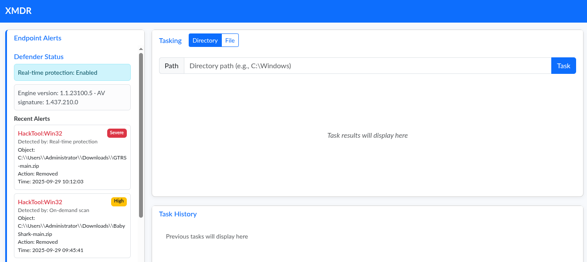
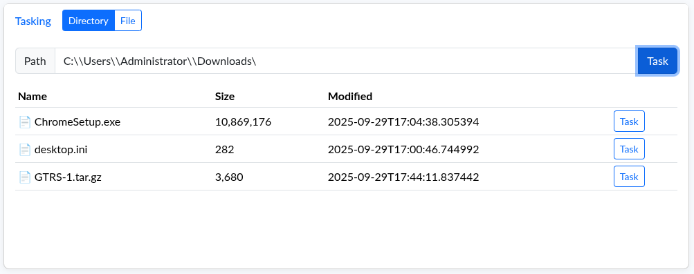
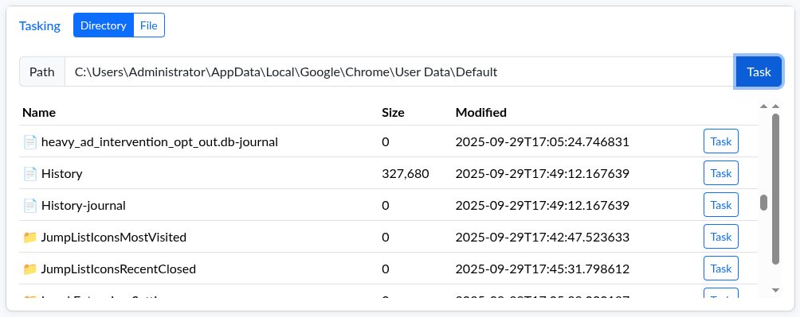
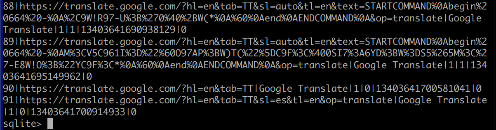
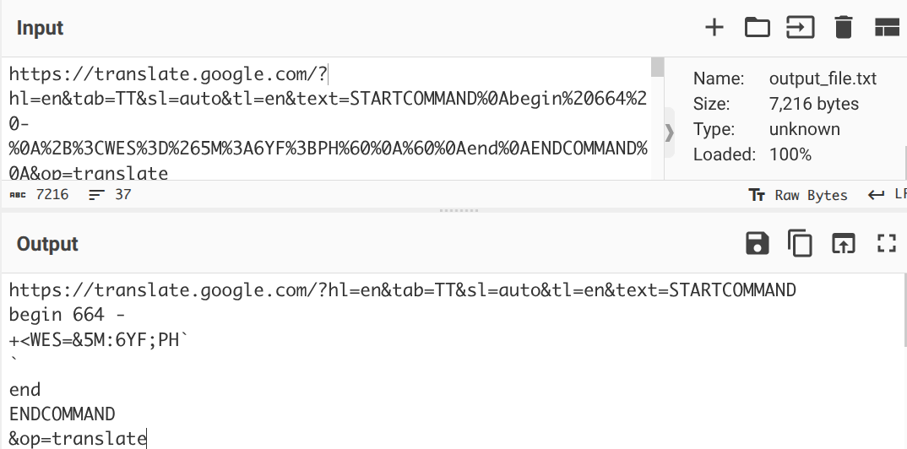
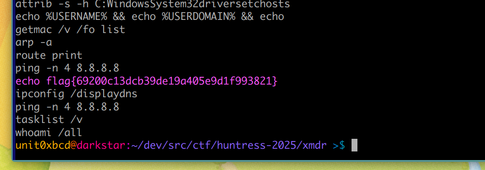

# XMDR

XMDR is a miscellaneous challenge from the Huntress 2025 CTF.

<em>
We had a lot of fun helping the Internet understand what MDRs are, but we thought of the next the best thing:
why not have you use one! 😄

A host that you protect had some strange alerts fire off... can you analyze and triage to find other malicious activity?
</em>




For this challenge we connect to a virtual host and use a console designed to look like an MDR (Managed Detection and Response) system. The console shows alerts down the side and allows the user to run some scripted tasks, such as listing running processes, system users, and directory contents. If an absolute filename is provided the console allows downloading the file.

I followed the alerts and explored the Administrator user downloads directory. I noticed the `GTRS-1.tar.gz` archive, likely related to the malicious `GTRS-main.zip` that was referenced in the alert. I downloaded this and examined the content.




```
unit0xbcd@darkstar:~/dev/src/ctf/huntress-2025/xmdr/GTRS-1 >$ ls
client.go  client.sh  Makefile  README.md  server.py
```

It contained a really interesting reverse shell that uses Google Translate pages as a relay to a C2 (command and control) server. It looks for commands with a particular syntax embedded in the HTML of the C2 webpage, executes them locally, then sends the results back encoded as base64.

Here I went down the wrong path for about half an hour. I assumed I needed to connect to this `server.py` instance and interact with it - but to do that I would need the secret key it generates on startup. I looked through various event logs trying to find the command line used to start the instance. When it wasn't apparent I went back and read the description again.

<em>A host that you protect had some strange alerts fire off... can you analyze and triage to find other malicious activity?</em>

I had not been thinking clearly about the 'MDR' aspect of the challenge. Everything on this system was here for a reason, and we were clearly being asked to think like defenders, not red teamers. I thought of other ways I could detect indicators of compromise on the system and remembered the Google Chrome installer I had seen in the Downloads directory. I went looking for browser history artefacts.



The Google Chrome History database had data and from the right period. I pulled it down and took a look. It is an sqlite database with various tables - I could have used visits or urls for this, I first looked at urls.



Here were the signs of our Google Translate relay. I pulled these out to a text file with a sqlite query and put them into CyberChef to urldecode.

```
sqlite> .headers on
sqlite> .once output_file.txt
sqlite> select url from urls where url like '%START%';

```



Some interesting blocks of text. The 'begin' and 'end' were pretty strong indicators the data was (uuencoded)[https://en.wikipedia.org/wiki/Uuencoding], a format that is used among other things to send binary data over email. Decoding a test payload gave me a windows shell command.

```
$ echo 'begin 664 -
> +<WES=&5M:6YF;PH`
> `
> end' | uudecode

systeminfo
```

With a working hypothesis I now needed to extract and decode all of the payloads. I wrote a small python script to do so, and one of the decoded commands included the flag.

```python

with open("output_file.txt", "r") as f:
    for line in f:
        line = line.strip()

# urldecode

        query = unquote_plus(urlparse(line).query)

# find the uuencoded payload

        payload = re.search(r'begin\s+664\s+-\r?\n([^\r\n]+)', query, re.I)

# uuendecode

        command = a2b_uu(payload.group(1)).decode('utf-8').strip()

# print 'em - colour for flag print

        if 'flag' in command:
            print(f"{Fore.LIGHTMAGENTA_EX}{command} {Style.RESET_ALL}")
        else:
            print(command)

```




